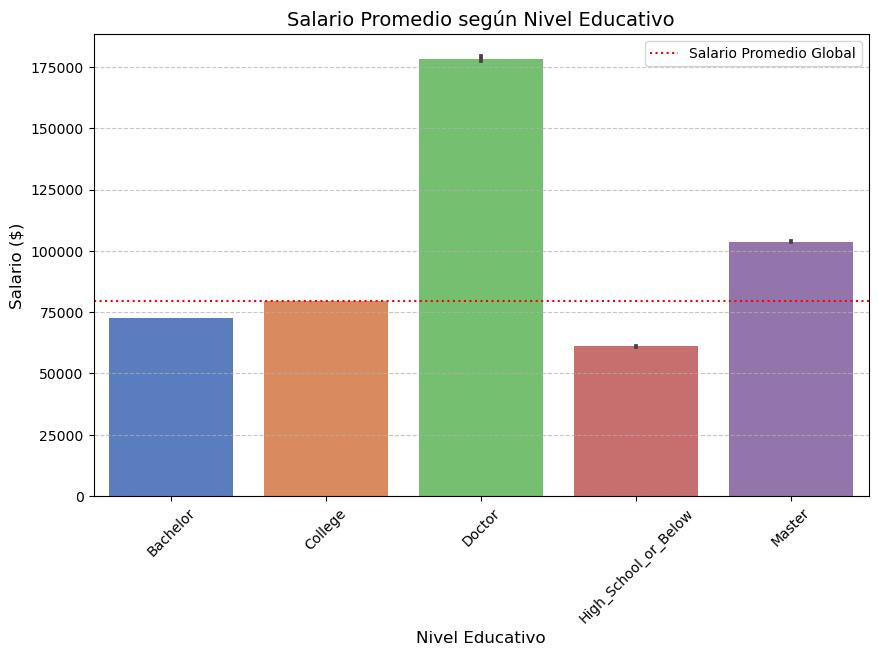
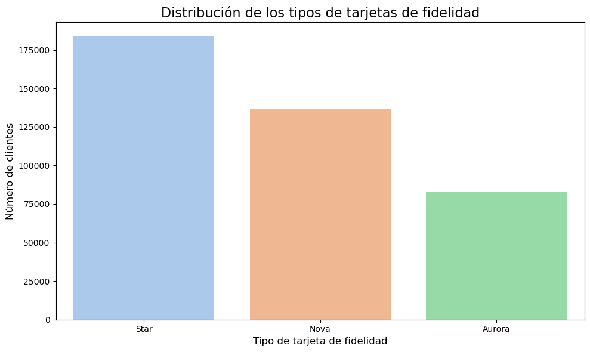
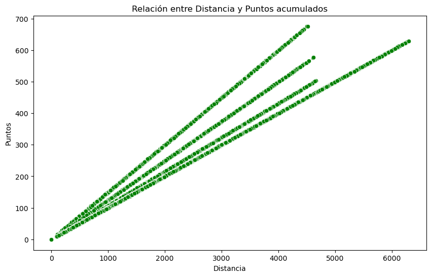

# 📊 Análisis de Datos de Clientes - Aerolínea ✈️

Este proyecto corresponde a la **Evaluación Final** del Módulo 3 de Data Analysis, donde se realiza un análisis exploratorio de los datos de los clientes de una aerolínea que participan en su programa de lealtad.

## 📝 Descripción del Proyecto

En este análisis, se exploran dos conjuntos de datos relacionados con la actividad de vuelo y el perfil de los clientes dentro de un programa de lealtad de una aerolínea. Los objetivos son realizar un análisis de los datos, visualizarlos y obtener conclusiones significativas sobre el comportamiento de los clientes.

### Archivos Utilizados:

- **Customer Flight Analysis.csv**: Contiene datos sobre la actividad de vuelo de los clientes, incluyendo los vuelos reservados, distancia volada, puntos acumulados y redimidos...

- **Customer Loyalty History.csv**: Incluye información sobre el perfil de los clientes, como ubicación, estado civil, género, educación, ingresos, tipo de tarjeta de lealtad...

## 🔍 Fases del Proyecto

🧹 Fase 1: Exploración y Limpieza de Datos

🔎 Exploración Inicial

Análisis preliminar para detectar valores nulos, duplicados y posibles errores en los datos.

🧽 Limpieza de Datos

- Normalización de nombres de columnas y valores categóricos.

- Conversión de tipos de datos incorrectos.

- Imputación de valores nulos mediante estrategias como la mediana o KNN.

- Separación de subconjuntos de datos (clientes activos vs. cancelaciones).

🗂️ Fase 2: Generación del Dataset Final

- Consolidación del dataset tras la limpieza.

📊 Fase 3: Visualización de Datos

Se desarrollaron diversas visualizaciones para responder preguntas clave sobre el comportamiento y perfil de los clientes:

📅 Distribución de vuelos reservados por mes.

✈️ Relación entre distancia recorrida y puntos acumulados.

🗺️ Distribución geográfica de clientes por provincia o ciudad.

🎓 Comparación de salario promedio según el nivel educativo.

💳 Proporción de clientes por tipo de tarjeta de fidelidad.

👥 Análisis demográfico según género y estado civil.

📌 Fase 4: Análisis Visual e Interpretación

Estudio de patrones observados en una de las gráficas.

Formulación de hipótesis basadas en esta visualización.

Identificación de áreas de interés para análisis más profundos.

## 📁 Estructura de Archivos

📁 files = Archivos csv orignales, limpios y csv final. 
Además de un data set que contiene todos los datos referentes a los clientes que han causado baja en su suscripción.

📁 doumentación = Archivos en los que se recoge información relevante y descriptiva del trabajo relizado durante el estudio, la transformación y visualización de los datos.

📁 doc_trabajo = Aquí encontramos 4 archivos que se corresponden con las fases del Proyecto desarrollado:

🔎 FASE_1 = EDA
🔎 FASE_2 = UNION
🔎 FASE_3 = VISUALIZACIÓN
🔎 FASE_4 = BONUS. Estudio de un patrón de datos.

## 🔧 Herramientas Utilizadas

- **Python**: Para análisis y manipulación de datos.

- **Pandas**: Para la manipulación y limpieza de los datos.

- **Matplotlib & Seaborn**: Para la creación de visualizaciones y gráficos.

## 📊 Resultados

Se generaron varias visualizaciones que muestran patrones significativos entre los datos, incluyendo:

📉 Barplot

Representa valores promedios o agregados por categoría.

📦 Countplot

Muestra el conteo de observaciones en cada categoría.

🟢 Scatterplot

Muestra la relación entre dos variables numéricas.

📊 Histplot

Histograma que muestra la distribución de una variable numérica.

🔥 Heatmap

Muestra una matriz de correlación visualmente.

## 🚀 Next Steps

♻️ Mejora de la transformación de datos y revisión de duplicados para garantizar la calidad y consistencia del dataset.

🔍 Análisis más profundo de clientes que cancelaron su suscripción (clientes_bajas.csv) para entender patrones y motivos.

📈 Segmentación de clientes basada en comportamiento, tipo de tarjeta.

📊 Visualización avanzada de correlaciones y relaciones entre variables (por ejemplo, nivel_educativo vs frecuencia de vuelos).

📉 Uso de hipótesis en gráficas basadas en patrones observados, para validar tendencias:

- Clientes con salario más alto canjean menos puntos.
- Clientes con tarjetas de nivel superior acumulan más puntos por la misma distancia recorrida.
- Clientes con tarjeta "Star" reservan más vuelos al mes que los de otras tarjetas.

💡 Modelado predictivo: explorar modelos que predigan cancelaciones o valor futuro del cliente.
