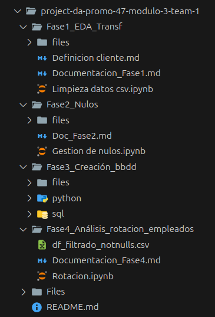
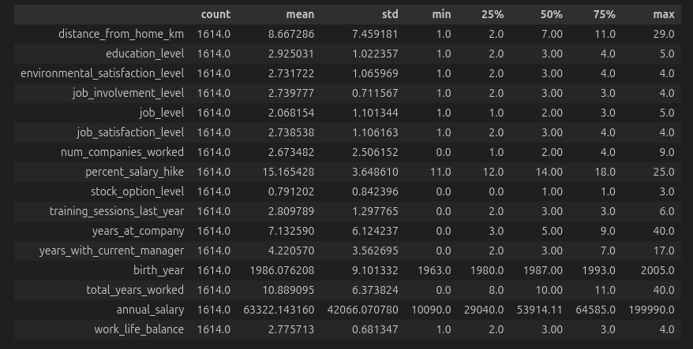
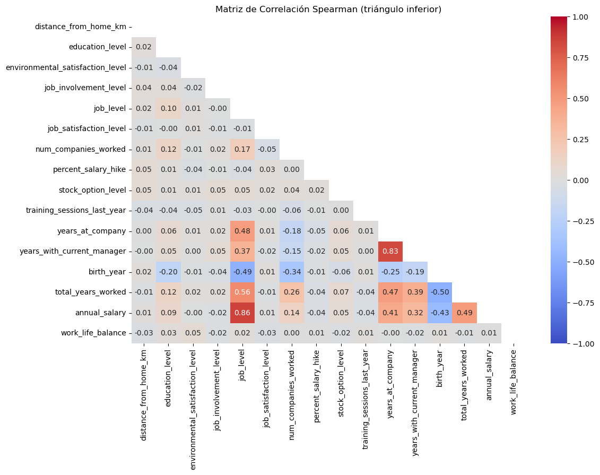
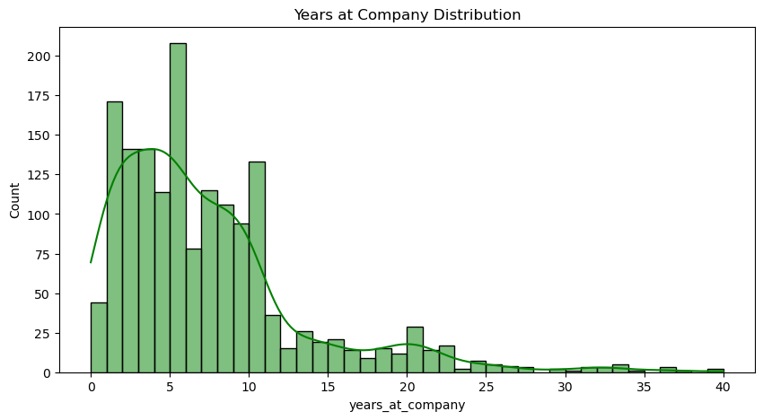
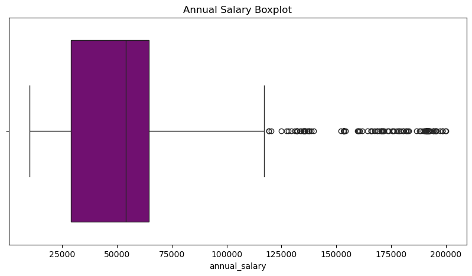

# 📌 OPTIMIZACIÓN DEL TALENTO

## DESCRIPCIÓN GENERAL

La empresa ABC Corporation busca reducir la rotación de empleados y mejorar la satisfacción de sus empleados en el entorno laboral.  Para ello, se desarrolla un proyecto de análisis de datos con el objetivo de identificar factores clave que influyen en la satisfacción y, en última instancia, en la retención de empleados.

## 📂 ESTRUCTURA DE ARCHIVOS

## 🛠️ ORGANIZACIÓN DEL TRABAJO

## 🗄️ FASE 1. CONOCEMOS Y MANEJAMOS LOS DATOS DEL ANÁLISIS

### ✏️ Análisis Exploratorio de Datos (EDA)

El análisis exploratorio de datos (EDA) fue fundamental para comprender las características del conjunto de datos y sus posibles problemas. 
Los pasos seguidos fueron:

🔓 Carga de Datos:

- Importación de los datos a un entorno de análisis.

🔓 Inspección Inicial del DataFrame:

- Inspección de las primeras filas y características de los datos con df.head() y df.info().

🔓 Análisis Estadístico Descriptivo:

- Estadísticas básicas (media, mediana, desviación estándar, etc.) para identificar valores atípicos y anomalías en los datos.

### ✏️ Transformación del DataFrame

🔓 Conversión de Tipos de Datos:

- Se realizaron conversiones de tipos de datos en columnas donde era necesario.

🔓 Homogenización y Consistencia de los Datos:

- Unificación de Formatos.

- Consistencia en los Valores Categóricos.

- Homogenización de Unidades de Medida.

## 🗄️ FASE 2: Evaluación e imputación de datos nulos

### ✏️ Identificación de Datos Nulos:

Se identificaron las columnas con valores nulos desde un análisis exhaustivo de los datos.

### ✏️ Tratamiento de los Valores Nulos:

#### Variables numéricas:

| Columna                            | Tipo                  | Estrategia manual aplicada | Valor imputado | Justificación                                                                 |
|-----------------------------------|------------------------|-----------------------------|----------------|---------------------------------------------------------------------------------|
| `total_years_worked`              | Numérica continua     | Moda                        | 10.0           | Valor más frecuente. Representa la mayoría de casos (ápice de la distribución).  |
| `annual_salary`                   | Numérica continua     | Mediana                     | 53914.11       | Valores extremos en sueldos. Se decide usar la mediana para evitar sesgos.     |
| `distance_from_home_km`           | Numérica continua     | Mediana                     | 7.0            | Distribución desigual. La mediana representa mejor la posición central.        |
| `work_life_balance`               | Categórica ordinal     | Moda                        | 3.0            | Escala de satisfacción. 3 es el valor más común (946 veces).                   |
| `environmental_satisfaction_level`| Categórica ordinal     | Mediana                     | 3.0            | Moda poco representativa. La mediana suaviza la distribución.                  |

#### Variables categóricas:

Las variables categóricas se imputaron usando el valor "unknown" en lugar de la moda, con el fin de **preservar trazabilidad** y poder identificar posteriormente los registros que originalmente tenían valores nulos. Esta estrategia permite mantener la información sobre la ausencia de datos sin introducir sesgo con una categoría existente.

| Columna                    | Tipo                 | Estrategia manual aplicada | Valor imputado | Justificación                                                  |
|----------------------------|-----------------------|-----------------------------|----------------|------------------------------------------------------------------|
| `marital_status`          | Categórica nominal   | Relleno con "unknown"       | "unknown"      | Mantener trazabilidad de nulos. Mejora interpretabilidad.       |
| `business_travel_frequency` | Categórica nominal  | Relleno con "unknown"       | "unknown"      | Trazabilidad. Evita asignar una categoría errónea por defecto. |
| `overtime_hours`          | Categórica nominal   | Relleno con "unknown"       | "unknown"      | Permite diferenciar empleados sin dato registrado.              |
| `standard_work_hours`     | Categórica binaria   | Relleno con "unknown"       | "unknown"      | Conserva información sin alterar las categorías reales.         |

---

## 🗄️ FASE 3: Creación de la base de datos

En esta fase, se diseñó la estructura de la base de datos para almacenar la información de manera eficiente y organizada. 

La base de datos está dividida en varias tablas, interrelacionadas entre sí para facilitar su gestión.

### ✏️ Revisión de los Datos

### ✏️ Estructura de las Tablas

### ✏️ Importación de los Datos

La fase de importación de los datos desde Python a la base de datos fue fundamental para trasladar la información procesada de manera efectiva, asegurando que los datos estuvieran correctamente estructurados y listos para su análisis. Utilizando herramientas como pandas y mysql.connector, se logró cargar los datos de manera eficiente y sin errores, garantizando la calidad e integridad de la información.

## 📊 FASE 4: Análisis de la Rotación de los Empleados

### ✏️ Análisis Descriptivo.

### ✏️ Análisis de Correlación.

### ✏️ Visualización de Datos.

### ✏️ Resultados y Hallazgos.

#### Algunas de las hipótesis a desarrollar serían las siguientes:

🔍 Frecuencia de viajes de empresa ("business_travel_frequency"): La categoría más frecuente es "unknown" (772 casos, 48 %). Esto puede ser preocupante a la hora de establecer conclusiones de resultados ya que hay muchos valores desconocidos. 

**Sería conveniente investigar si los valores "unknown" pueden ser imputados o descartados.** 

🔍 Género ("gender"): Predominan los hombres (971 casos, 60 %) frente a las mujeres (643 casos, 39,84 %). 

**Podría analizarse si hay diferencias en rotación por género.**

🔍 Estado civil ("marital_status"): Hay muchos valores "unknown" (651 casos,  40,33 %), lo que nuevamente sugiere problemas con la calidad de los datos. 

**Si esta variable fuera relevante, podríamos considerar estrategias de imputación.**

🔍 Horas extra (overtime_hours): La mayoría de empleados no hacen horas extra (682 casos, 42,25%). 

**Sería conveniente estudiar en mayor profundidad si hay relación entre hacer horas extra y la rotación.**

🔍 Tipo de jornada (standard_work_hours): 888 empleados (55,02 %) trabajan a tiempo parcial. 

**Esto puede ser un factor relevante para analizar la rotación.**

🔍 Trabajo remoto (remote_work): 1000 empleados trabajan en remoto (61,95 %). 

**Podríamos analizar si el trabajo remoto reduce la rotación.**

## 📦 BIBLIOTECAS Y HERRAMIENTAS UTILIZADAS

### Python 🐍

#### Pandas 📊

Descripción: Utilizado para el procesamiento y análisis de datos.

#### NumPy 🔢

Descripción: Biblioteca fundamental para el cálculo numérico en Python.

#### Matplotlib 📈

Descripción: Biblioteca para la creación de gráficos estáticos.

#### Seaborn 🌈

Descripción: Extensión de Matplotlib que facilita la creación de gráficos estadísticos complejos.

#### SQLAlchemy 🗄️

Descripción: Herramienta para interactuar con bases de datos SQL desde Python.

#### Jupyter Notebooks 📓

Descripción: Herramienta para desarrollo interactivo de código.

### SQL 🗃️

#### MySQL 🐬 

Descripción: Sistema de gestión de bases de datos relacional utilizado para almacenar y gestionar datos.

## 🎥 Presentación final del proyecto

🧠 Hemos preparado una presentación en Canva para explicar el enfoque, las fases del proyecto y nuestras conclusiones.

👉 Puedes verla aquí: [Presentación Canva – DataMind](https://www.canva.com/design/DAGjZyqj95Q/-4QHk3NFcRy3qP5r0kzVkA/edit?utm_content=DAGjZyqj95Q&utm_campaign=designshare&utm_medium=link2&utm_source=sharebutton)

## 📑 Informe final del proyecto

Además de este README, hemos elaborado un informe final completo en formato PDF.

👉 Puedes consultarlo aquí: [📄 Informe Final – ABC Corporation](./Informe.pdf)

## 📝 Autoras y agradecimientos

Este proyecto ha sido desarrollado por el equipo **🧠 DataMind** dentro del Programa de Data Analytics de Adalab (Promoción 49).

Queremos agradecer especialmente al equipo docente por su acompañamiento durante el módulo, y a nuestras compañeras por la colaboración, la paciencia y el apoyo constante.

💡 Cualquier comentario o feedback será más que bienvenido.  
¡Gracias por acompañarnos en este viaje de datos! 😊

— **🧠 Equipo DataMind** | Abril 2025
